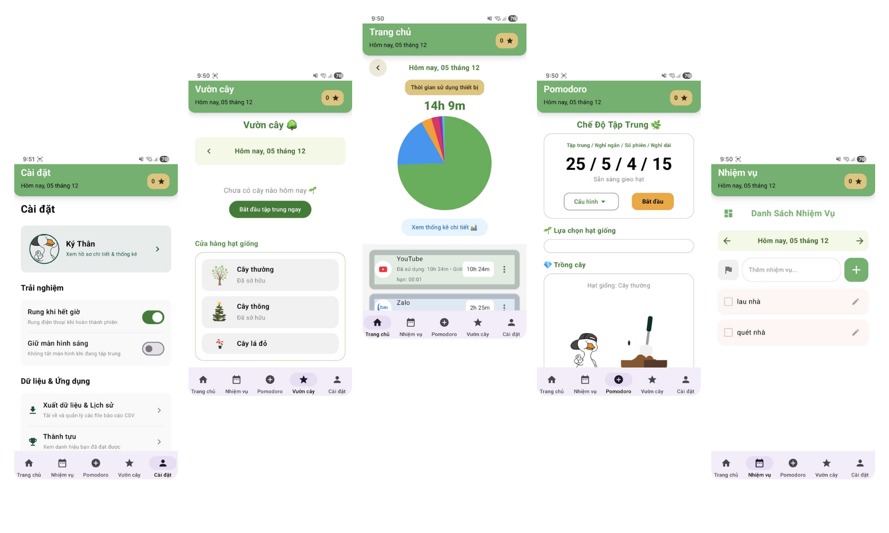

<h1 align = "center">
  <b>DUCKTRACK - PERSONAL DEVELOPMENT APPLICATION</b>
</h1>

<p align="center">
  
  
  
</p>

<h2>
  DESCRIPTION
</h2>

<p>
  DuckTrack is a self-improvement app designed to help users build better habits, stay disciplined, and improve focus. It includes features such as daily planning, Pomodoro focus sessions, and optional app-usage tracking to reduce distractions. DuckTrack provides a supportive environment for productivity, enabling users to achieve their study and work goals more effectively.
</p>

<h2>
  Preview
</h2>

<p align="center">
  
</p>

<h2>
  Current Features
</h2>

- Daily Planning: Create, organize, and manage personal goals and tasks for each day.
- Pomodoro Focus Sessions: Improve concentration with structured Pomodoro work cycles.
- App Usage Limiting: Set daily usage limits for specific apps to reduce distractions.
- Blocking Overlay: Displays a blocking screen when the limit is exceeded, with options to extend time or remove the limit.
- App Usage Tracking: Records and summarizes daily app usage to help users adjust their habits.
- Clean and Intuitive UI: User-friendly design for fast and efficient interaction.

<h2>
 Technologies Used
</h2>

- Language & UI: Kotlin, Android Jetpack Compose
- Backend & Storage: Room Database, Firebase (Firestore, Authentication)
- Architecture: MVVM (Model–View–ViewModel)
- Task Handling: Coroutines, Flow, WorkManager, Foreground Service
- Libraries & APIs: UsageStatsManager API, MPAndroidChart

<h2>
  Installation & Usage
</h2>

### 1. Clone the project
```bash
https://github.com/thanky1810/DuckTrack.git
```
- Open the project using Android Studio.
   
### 2. Create a Firebase project
- Visit the Firebase console:
https://console.firebase.google.com
- Create a new project.
- Add an Android app with the package name used in your project.
- Download the generated google-services.json file.

### 3.Add Firebase configuration
- Place the downloaded file into:
```bash
app/src/main/google-services.json
```

- Ensure the Firebase plugin lines exist in your Gradle files:

  - build.gradle (Project level)
  - build.gradle (App module)
 
### 4.Sync the project
- Let Gradle download all dependencies.
- Resolve any missing Firebase components if prompted.

### 5.Build & Run the app
- Connect a physical Android device or start an emulator.
- Click Run in Android Studio to install the application.
